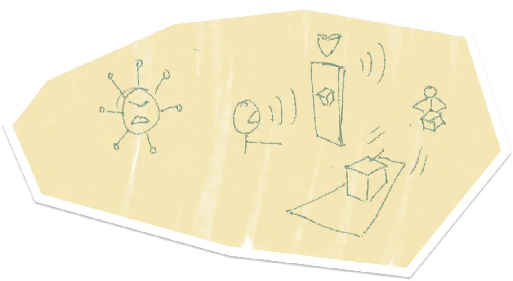
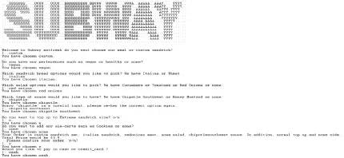

# Subwayo

It is one of the [NTU](https://www.ntu.edu.sg/)'s CZ3005 Artificial Intelligence Module Project

## What?

We are tasks to developed an artificial intelligence application using knowledge-based interaction

## Why?

To apply knowledge-based logics we learnt from this module

## How?

1. Research on possible application for this use case
2. Defined the possible flows
3. Proof of Concept (POC) of the chosen flow
4. Defined all required functions, terms, facts and rules
5. Construct data templates and insert data knowledge
6. Compile and Execute the binary file
7. Run and test the expected outcomes
8. Improve the process and update accordingly

## Highlights

## Disclaimer

All external data and assets in this project used is intended for educational purpose only.

## Contributor

Subwayo Team
